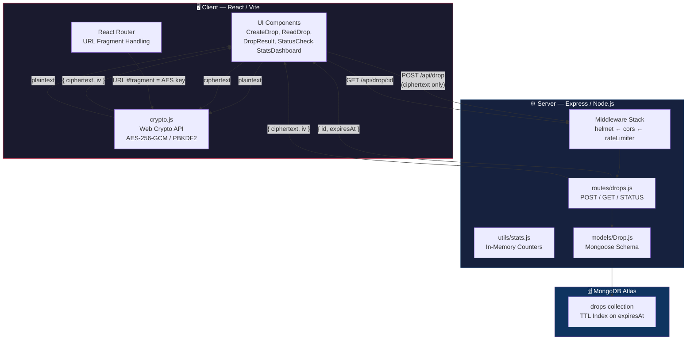
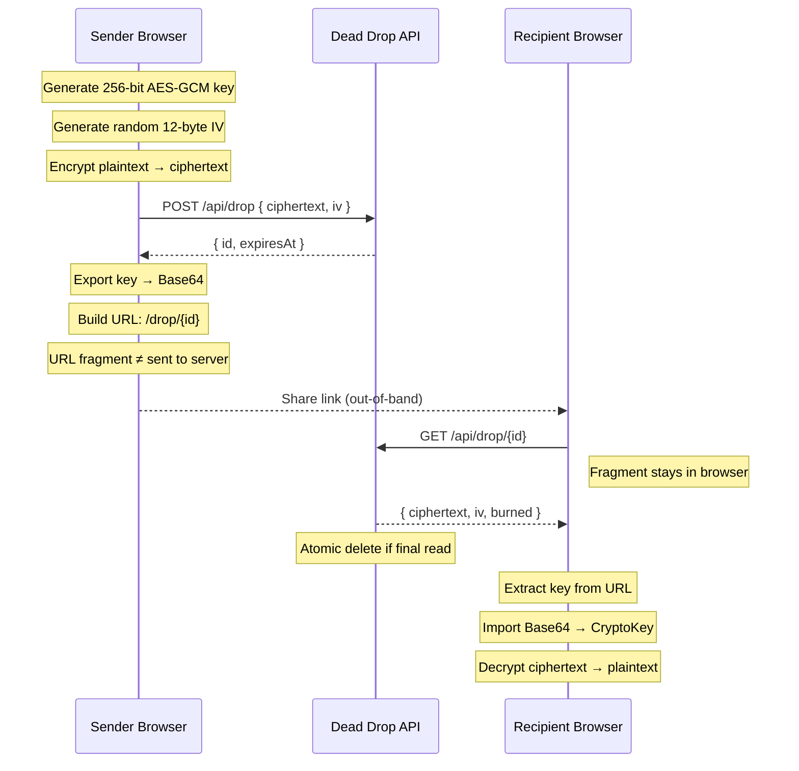
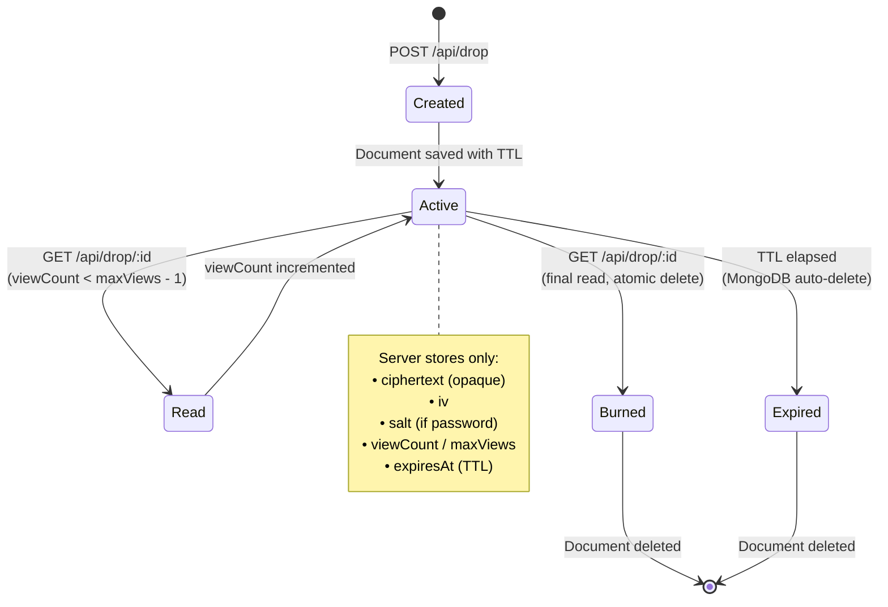

<p align="center">
  
</p>

<h1 align="center">Dead Drop</h1>

<p align="center">
  <strong>Zero-knowledge secret sharing with client-side AES-256-GCM encryption.</strong>
  <br />
  The server never sees your plaintext. The key never leaves your browser.
</p>

<p align="center">
  <a href="#system-architecture">Architecture</a> •
  <a href="#security-model">Security</a> •
  <a href="#encryption-flows">Encryption</a> •
  <a href="#third-party-libraries">3rd Party</a> •
  <a href="#api-reference">API</a> •
  <a href="#local-development">Setup</a>
</p>

---

## What It Does

Dead Drop is a zero-knowledge secret-sharing web app for transmitting sensitive text — credentials, API keys, recovery codes, one-time notes. Payloads are **encrypted in the browser** before touching the network. The server stores only opaque ciphertext plus the metadata needed to expire or burn the drop.

- 🔐 **AES-256-GCM encryption** via the native Web Crypto API — zero crypto dependencies.
- 🔥 **Burn-after-read** links with atomic server-side deletion.
- 🔑 **Optional PBKDF2 password protection** with 100K iterations.
- ⏱️ **Auto-expiry** via MongoDB TTL indexes (1h, 24h, 7d).
- 📱 **QR code generation** for mobile-friendly sharing.
- 🛡️ **Security headers** powered by Helmet (HSTS, CSP, COOP, CORP, and more).
- 🚦 **Rate limiting** with stricter thresholds on read endpoints.
- 👁️ **Display deterrents** — blur on unfocus, shortcut blocking, context menu disabled.

---

## System Architecture



### Request Flow

```
Browser                         Server                        MongoDB
  │                               │                              │
  │  1. Generate AES-256 key      │                              │
  │  2. Encrypt payload locally   │                              │
  │                               │                              │
  │─── POST /api/drop ───────────▶│                              │
  │    { ciphertext, iv }         │  3. Validate input           │
  │                               │  4. UUID validation          │
  │                               │──── Insert document ────────▶│
  │                               │◀─── { _id, expiresAt } ─────│
  │◀── { id, expiresAt } ────────│                              │
  │                               │                              │
  │  5. Build URL:                │                              │
  │     /drop/:id#base64-key      │                              │
  │     (key in fragment only)    │                              │
  │                               │                              │
  ├─── Share link to recipient ───┤                              │
  │                               │                              │
  │─── GET /api/drop/:id ────────▶│                              │
  │    (no fragment sent!)        │  6. UUID validation          │
  │                               │  7. Read rate limit check    │
  │                               │──── Atomic read/delete ─────▶│
  │                               │◀─── { ciphertext, iv } ─────│
  │◀── { ciphertext, iv } ───────│                              │
  │                               │                              │
  │  8. Import key from #fragment │                              │
  │  9. Decrypt locally           │                              │
  │  10. Display plaintext        │                              │
  └───────────────────────────────┘                              │
```

---

## Encryption Flows

### Link-Key Flow (Default)



### Password Flow (Optional)

```mermaid
sequenceDiagram
    participant S as Sender Browser
    participant API as Dead Drop API
    participant R as Recipient Browser

    Note over S: Generate random 16-byte salt
    Note over S: PBKDF2(password, salt, 100K, SHA-256) → AES key
    Note over S: Encrypt plaintext → ciphertext

    S->>API: POST /api/drop { ciphertext, iv, salt, hasPassword:true }
    API-->>S: { id, expiresAt }

    Note over S: Build URL: /drop/{id}
    Note over S: No fragment key in URL

    S-->>R: Share link + password (separately)

    R->>API: GET /api/drop/{id}
    API-->>R: { ciphertext, iv, salt, hasPassword:true }

    Note over R: Prompt for password
    Note over R: PBKDF2(password, salt, 100K, SHA-256) → AES key
    Note over R: Decrypt ciphertext → plaintext
```



---

## Drop Lifecycle



---

## Security Model

Dead Drop is designed so the server **cannot** decrypt stored payloads.

### Zero-Knowledge Guarantees

| Property | How It's Enforced |
|----------|-------------------|
| **Server never sees plaintext** | Encryption happens in-browser before `POST` |
| **Server never sees the key** | AES key lives in URL `#fragment` (never sent in HTTP requests) |
| **Forward secrecy per drop** | Each drop generates a fresh random AES-256 key |
| **Burn verification** | Final read uses `findOneAndDelete` (atomic MongoDB operation) |
| **Expiry enforcement** | MongoDB TTL index auto-deletes documents server-side |

### Server-Side Protections

| Layer | Implementation | Purpose |
|-------|----------------|---------|
| **HSTS** | `Strict-Transport-Security: max-age=63072000` | Force HTTPS for 2 years |
| **CSP** | `script-src 'self'` — no `unsafe-inline` | Block XSS injection |
| **COOP/CORP** | `same-origin` | Side-channel attack isolation |
| **X-Frame-Options** | `DENY` | Prevent clickjacking |
| **Referrer-Policy** | `no-referrer` | Hide URL fragments in referrals |
| **Rate Limiting** | 100 req/15min global, 20 req/15min on reads | DoS & brute-force prevention |
| **UUID Validation** | Regex check before DB queries | NoSQL injection prevention |
| **Input Validation** | Ciphertext ≤ 500KB, IV ≤ 24 chars | Abuse prevention |
| **CORS** | Strict origin whitelist via `cors` package | Cross-origin request control |
| **Body Limit** | 1MB max request body | Payload abuse prevention |

### Client-Side Deterrents

| Deterrent | Technique |
|-----------|-----------|
| **Blur on unfocus** | Window `blur`/`visibilitychange` → overlay | 
| **Block shortcuts** | `Ctrl+C/A/U/P/S`, `F12`, `Ctrl+Shift+I/J/C` intercepted |
| **Context menu** | `contextmenu` event prevented |
| **PrintScreen** | Clipboard overwritten as deterrent |

> ⚠️ **Important**: Client-side deterrents are **display-level** only. They discourage casual capture but cannot stop a determined actor with dev tools, a modified browser, or hardware capture.

### Threat Model

| Threat | Mitigation | Residual Risk |
|--------|------------|---------------|
| Server compromise | Server has only ciphertext; no key material | None — mathematically impossible to decrypt |
| Network eavesdropping | HSTS enforces TLS; key in fragment (not transmitted) | None if TLS is intact |
| Brute-force password | PBKDF2 100K iterations + read rate limiting (20/15min) | Weak passwords remain vulnerable |
| Link interception | Burn-after-read ensures single use | Attacker who intercepts first wins |
| XSS on client | CSP `script-src 'self'` blocks inline scripts | Zero-day browser vulnerabilities |
| MongoDB injection | UUID regex validation before all queries | None — invalid IDs rejected at middleware |

---

## Project Structure

```
dead-drop/
├── client/                          # React / Vite frontend
│   ├── public/
│   │   ├── favicon.svg              # App icon
│   │   ├── icons.svg                # UI icon sprites
│   │   ├── manifest.json            # PWA manifest
│   │   ├── robots.txt               # Search engine directives
│   │   └── sitemap.xml              # SEO sitemap
│   ├── src/
│   │   ├── components/
│   │   │   ├── AboutCreator.jsx     # Zero-trust protocol description
│   │   │   ├── CreateDrop.jsx       # Drop creation form + encryption
│   │   │   ├── DropResult.jsx       # Success page with QR + share link
│   │   │   ├── Hero.jsx             # Landing page hero section
│   │   │   ├── Navbar.jsx           # Navigation + dark/light theme toggle
│   │   │   ├── ReadDrop.jsx         # Drop reading + decryption + password prompt
│   │   │   ├── ScrollToTop.jsx      # Route change scroll behavior
│   │   │   ├── StatsDashboard.jsx   # Live network telemetry counters
│   │   │   └── StatusCheck.jsx      # Non-destructive drop status lookup
│   │   ├── utils/
│   │   │   └── crypto.js            # AES-GCM + PBKDF2 (Web Crypto API)
│   │   ├── App.jsx                  # Routes + display protection behavior
│   │   ├── App.css                  # Component-specific styles
│   │   ├── index.css                # Global design tokens + styles
│   │   └── main.jsx                 # React DOM entry + BrowserRouter
│   ├── index.html                   # SPA entry with SEO meta tags
│   ├── vite.config.js               # Dev proxy + React plugin
│   ├── tailwind.config.js           # Tailwind/PostCSS config
│   ├── postcss.config.js            # PostCSS plugin chain
│   ├── eslint.config.js             # Lint rules
│   ├── vercel.json                  # Vercel SPA rewrites
│   └── package.json                 # Client dependencies
│
├── server/                          # Express API backend
│   ├── middleware/
│   │   ├── securityHeaders.js       # Helmet-powered security headers
│   │   └── rateLimiter.js           # General + read-specific rate limiters
│   ├── models/
│   │   └── Drop.js                  # Mongoose schema + TTL index
│   ├── routes/
│   │   └── drops.js                 # CRUD endpoints + UUID validation
│   ├── utils/
│   │   └── stats.js                 # In-memory telemetry counters
│   ├── index.js                     # Express app + CORS + DB connection
│   ├── vercel.json                  # Vercel serverless config
│   ├── .env.example                 # Environment variable template
│   └── package.json                 # Server dependencies
│
├── .gitignore                       # Root-level git ignores
└── README.md                        # ← You are here
```

---

## Third-Party Libraries

### Server Dependencies

| Package | Version | Purpose | Security Role | Docs |
|---------|---------|---------|---------------|------|
| **express** | ^4.21 | HTTP server framework | Middleware chain, request parsing, routing | [expressjs.com](https://expressjs.com/) |
| **mongoose** | ^8.9 | MongoDB ODM | Schema validation, TTL index for auto-expiry, atomic operations (`findOneAndDelete`) | [mongoosejs.com](https://mongoosejs.com/) |
| **express-rate-limit** | ^7.5 | IP-based rate limiting | DoS/brute-force prevention; 100 req/15min global, 20 req/15min on read endpoints | [npm](https://www.npmjs.com/package/express-rate-limit) |
| **helmet** | ^8.x | Security HTTP headers | Sets 15+ headers: HSTS, CSP, COOP, CORP, X-Frame-Options, X-Content-Type-Options, etc. | [helmetjs.github.io](https://helmetjs.github.io/) |
| **cors** | ^2.x | CORS policy enforcement | Strict origin whitelisting, blocks unauthorized cross-origin requests | [npm](https://www.npmjs.com/package/cors) |
| **dotenv** | ^16.4 | Env variable loader | Keeps secrets (MongoDB URI) out of source code | [npm](https://www.npmjs.com/package/dotenv) |

### Client Dependencies

| Package | Version | Purpose | Security Role | Docs |
|---------|---------|---------|---------------|------|
| **react** | ^19.2 | UI component framework | Renders encrypted/decrypted views | [react.dev](https://react.dev/) |
| **react-dom** | ^19.2 | React DOM renderer | Browser rendering target | [react.dev](https://react.dev/) |
| **react-router-dom** | ^7.15 | Client-side routing | URL `#fragment` handling — keeps AES key out of HTTP requests | [reactrouter.com](https://reactrouter.com/) |
| **framer-motion** | ^12.38 | Animation library | UI polish only (page transitions, micro-animations) | [motion.dev](https://motion.dev/) |
| **qrcode** | ^1.5 | QR code generation | Encodes share URLs for mobile scanning | [npm](https://www.npmjs.com/package/qrcode) |

### Native Browser APIs (Zero Dependencies)

| API | Usage | Why Native |
|-----|-------|------------|
| **Web Crypto API** (`crypto.subtle`) | AES-256-GCM key generation, encryption, decryption | Audited by browser vendors; no third-party trust required |
| **PBKDF2** (`crypto.subtle.deriveKey`) | Password → AES key derivation (100K iterations, SHA-256) | Hardware-accelerated in modern browsers |
| **`crypto.getRandomValues`** | Random IV (12 bytes) and salt (16 bytes) generation | CSPRNG provided by the OS |

### Dev Dependencies (Not in Production)

| Package | Purpose |
|---------|---------|
| **vite** | Dev server with HMR + production bundler |
| **@vitejs/plugin-react** | React JSX transform for Vite |
| **tailwindcss** | Utility CSS framework (build-time only) |
| **postcss** / **autoprefixer** | CSS post-processing |
| **eslint** + plugins | Code quality linting |

---

## API Reference

Base path: `/api`

### `POST /api/drop`

Creates a new encrypted drop.

**Request:**
```json
{
  "ciphertext": "base64-ciphertext",
  "iv": "base64-iv",
  "salt": "base64-salt-or-null",
  "hasPassword": false,
  "maxViews": 1,
  "expiryOption": "burn_after_read"
}
```

**Validation Rules:**
- `ciphertext`: Required, non-empty string, ≤ 500KB
- `iv`: Required, non-empty string, ≤ 24 characters
- `maxViews`: Must be `1`, `3`, or `5` (defaults to `1`)
- `expiryOption`: Must be one of the values below (defaults to `24h`)

| `expiryOption` | TTL |
|----------------|-----|
| `burn_after_read` | 24h max, deleted on read |
| `1h` | 1 hour |
| `24h` | 24 hours |
| `7d` | 7 days |

**Response** `201`:
```json
{
  "id": "550e8400-e29b-41d4-a716-446655440000",
  "expiresAt": "2026-05-24T12:00:00.000Z"
}
```

---

### `GET /api/drop/:id`

Fetches encrypted data and burns the drop on the final read. **Rate limited to 20 requests per 15 minutes per IP.**

**Validation:** `:id` must be a valid UUID v4 format.

**Response** (multi-read, views remaining):
```json
{
  "ciphertext": "base64-ciphertext",
  "iv": "base64-iv",
  "salt": null,
  "hasPassword": false,
  "burned": false,
  "viewsRemaining": 2
}
```

**Response** (final read — document deleted):
```json
{
  "ciphertext": "base64-ciphertext",
  "iv": "base64-iv",
  "salt": null,
  "hasPassword": false,
  "burned": true
}
```

**Response** `404`:
```json
{ "error": "This drop no longer exists." }
```

---

### `GET /api/drop/:id/status`

Non-destructive check — does not consume a view.

**Response** (alive):
```json
{ "alive": true, "expiresAt": "2026-05-24T12:00:00.000Z" }
```

**Response** (dead):
```json
{ "alive": false }
```

---

### `GET /api/stats`

In-memory telemetry counters (resets on server restart).

```json
{
  "totalDropsCreated": 42,
  "totalBurnedToday": 7
}
```

---

### `GET /api/health`

```json
{ "status": "ok", "timestamp": "2026-05-23T12:00:00.000Z" }
```

---

## Local Development

### Prerequisites

- **Node.js** 18+
- **npm**
- **MongoDB** (local or [Atlas](https://www.mongodb.com/atlas))

### Install

```bash
# Client
cd client
npm install

# Server
cd ../server
npm install
```

### Configure Environment

Copy the template and fill in your values:

```bash
cd server
cp .env.example .env
```

Edit `server/.env`:
```env
MONGODB_URI=mongodb+srv://<user>:<password>@<cluster>.mongodb.net/<dbname>
PORT=3001
CLIENT_ORIGIN=http://localhost:5173
```

Optional `client/.env`:
```env
VITE_API_PROXY=http://localhost:3001
```

For a separately hosted API:
```env
VITE_API_URL=https://your-api.example.com
```

> When `VITE_API_URL` is empty, frontend requests use relative `/api/...` paths. During Vite development, those are proxied to `VITE_API_PROXY` or `http://localhost:3001`.

### Run

```bash
# Terminal 1 — API
cd server
npm run dev

# Terminal 2 — Frontend
cd client
npm run dev
```

Open **http://localhost:5173**

---

## Deployment

The repository includes Vercel configuration for both surfaces:

| Surface | Config | Runtime |
|---------|--------|---------|
| Frontend | `client/vercel.json` | Static (Vite build) |
| Backend | `server/vercel.json` | Serverless (`@vercel/node`) |

### Production Environment Variables (Server)

| Variable | Required | Description |
|----------|----------|-------------|
| `MONGODB_URI` | ✅ | MongoDB connection string |
| `CLIENT_ORIGIN` | ✅ | Frontend origin for CORS (e.g., `https://dead-drop-two.vercel.app`) |
| `PORT` | ❌ | Server port (default: `3001`, ignored on Vercel) |

### Production Environment Variables (Client)

| Variable | Required | Description |
|----------|----------|-------------|
| `VITE_API_URL` | ❌ | Full backend URL if hosted separately |

---

## Scripts

**Client:**
```bash
npm run dev       # Vite dev server with HMR
npm run build     # Production build to dist/
npm run preview   # Preview production build
npm run lint      # ESLint check
```

**Server:**
```bash
npm run dev       # Node.js with --watch (auto-restart)
npm start         # Production start
```

---

## Operational Notes

- API routes are rate-limited: **100 req/15min** globally, **20 req/15min** on read endpoints.
- Request bodies are limited to **1 MB**.
- Ciphertext is capped at **500 KB** per drop.
- MongoDB auto-deletes expired documents via the `expiresAt` TTL index.
- Stats are in-memory counters, useful for display but not durable analytics.
- The backend accepts both `MONGODB_URI` and `MONGO_URI`, preferring `MONGODB_URI`.
- Drop IDs are validated as UUID format before any database query.
- All error responses use generic messages — no internal details are leaked.

---

## License

No license file is currently included. Add one before distributing or accepting external contributions.

---

<p align="center">
  <sub>Built by <a href="https://github.com/aadityaexe">Aditya Kumar</a></sub>
</p>
